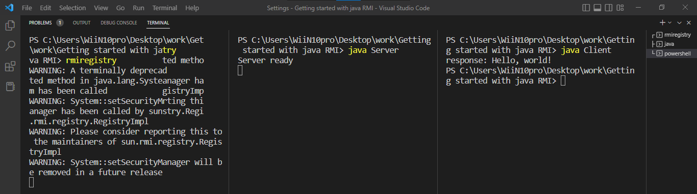

# Remote Method Invocation

### RMI registry
A Java RMI registry is a simplified name service that allows clients to get a reference (a stub) to a remote object. In general, a registry is used (if at all) only to locate the first remote object a client needs to use.

For more information, refer [docs](https://docs.oracle.com/javase/8/docs/technotes/guides/rmi/hello/hello-world.html#:~:text=A%20Java%20RMI%20registry%20is,a%20client%20needs%20to%20use.)

### Output:

